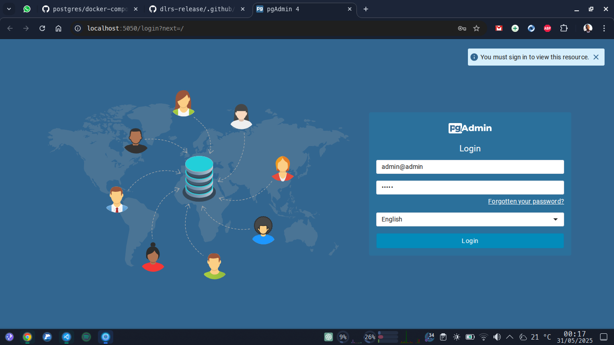
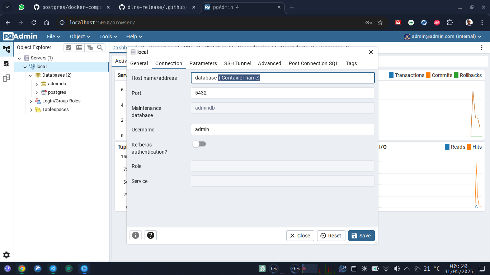

# pgAdmin 4 + PostgreSQL

Database & WebUI

### Create a docker network
```bash
docker network db_net
```
### Variables
**pgAdmin4**
- PGADMIN_DEFAULT_EMAIL="admin@admin.com"
- PGADMIN_DEFAULT_PASSWORD="admin"

**PostgreSQL**
- POSTGRES_USER="admin"
- POSTGRES_PASSWORD="admin"
- POSTGRES_DB="admindb"

### Up services
```bash
docker compose up -d
```

Web UI: http://localhost:5050/


Database
